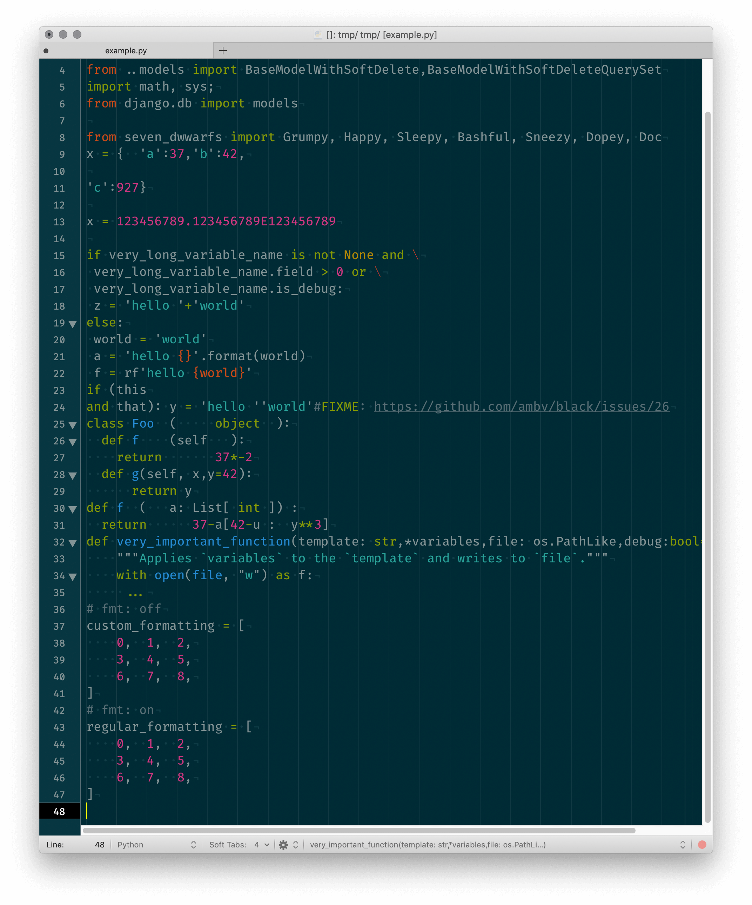
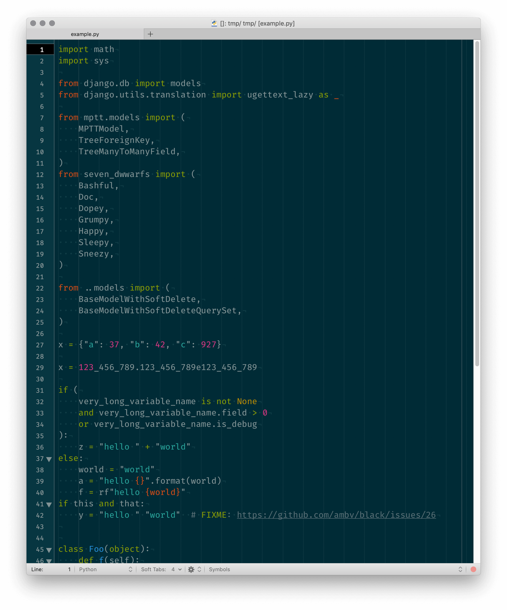

# Python FMT bundle for TextMate

Hit <kbd>⌘</kbd> + <kbd>S</kbd> I’ll handle the rest!

While writing Python code in `Python` or `Django` scope, this bundle
handles before and after save events and formats/lints/checks your code.

Using:

- [autopep8][01]
- [flake8][02]
- [isort][03]

Todo:

- Black integration...

## Screenshots

Before Python FMT for TextMate:



After Python FMT for TextMate bundle:




## Installation: `pyenv` Users

Checker your Python binary:

```bash
$ pyenv which python
/Users/vigo/.pyenv/versions/3.6.4/bin/python # example output
```

Install packages:

```bash
$ pip install autopep8 isort
$ pip install -e git+https://gitlab.com/pycqa/flake8#egg=flake8
```

Then set `TM_PYTHON` variable from **TextMate > Preferences > Variables**:

    TM_PYTHON    /Users/vigo/.pyenv/versions/3.6.4/bin/python

Now bundle auto discovers the packages. Now clone repo:

```bash
$ cd ~/Library/Application\ Support/TextMate/Bundles/
$ git clone https://github.com/vigo/textmate2-python-fmt.git Python-FMT.tmbundle
```

and restart TextMate!

## Installation: `homebrew` Users

Check you Python and set `TM_PYTHON` variable from **TextMate > Preferences > Variables**:

```bash
$ which python
/usr/local/bin/python # example output
$ pip install autopep8 isort
$ pip install -e git+https://gitlab.com/pycqa/flake8#egg=flake8
```

    TM_PYTHON    /usr/local/bin/python

Now clone repo:

```bash
$ cd ~/Library/Application\ Support/TextMate/Bundles/
$ git clone https://github.com/vigo/textmate2-python-fmt.git Python-FMT.tmbundle
```

and restart TextMate!

## Installation: macOS Defaults

```bash
$ sudo /usr/bin/easy_install --script-dir=/usr/bin/ flake8
$ sudo /usr/bin/easy_install --script-dir=/usr/bin/ autopep8
$ sudo /usr/bin/easy_install --script-dir=/usr/bin/ isort
```

You don’t need to set `TM_PYTHON` variable... Now clone repo:

```bash
$ cd ~/Library/Application\ Support/TextMate/Bundles/
$ git clone https://github.com/vigo/textmate2-python-fmt.git Python-FMT.tmbundle
```

and restart TextMate!

---

## Recommended flake8 plugins

* `flake8-blind-except`: Checks for blind, catch-all `except:` statements.
* `flake8-builtins`: Check for python builtins being used as variables or parameters
* `flake8-import-order`: Check invalid import order (*double checks after isort*)
* `flake8-commas`: Add trailing commas
* `flake8-quotes`: Install this if you are single quote person like me!
* `flake8-string-format`: Checks for strings and parameters using `str.format`
* `flake8-print`: Checks for `print` statements in python files.
* `flake8-bugbear`: A plugin for Flake8 finding likely bugs and design problems in your program.

To install all:

```bash
# Homebrew or pyenv
$ pip install flake8-blind-except flake8-builtins flake8-import-order flake8-commas flake8-quotes flake8-string-format flake8-bugbear # or

# macOS Defaults
$ sudo /usr/bin/easy_install --script-dir=/usr/bin/ flake8-blind-except flake8-builtins flake8-import-order flake8-commas flake8-quotes flake8-string-format flake8-bugbear
```

---

## TextMate Variables

`TM_PYTHON_FMT_AUTOPEP8`  
It’s possible to set binary location of `autopep8`. This is handy if you don’t
set `TM_PYTHON` variable.


`TM_PYTHON_FMT_CUSTOM_MAX_CHARS`  
By default, maximum character limit is: `79`. Use this variable to set yours.


`TM_PYTHON_FMT_DJANGO_MAX_CHARS`  
Django allows `119` characters. If your scope is `source.django` and you would
like to check against 119 chars (*or what number you’d like to*), you need to 
set `TM_PYTHON_FMT_DJANGO_MAX_CHARS`.


`TM_PYTHON_FMT_AUTOPEP8_EXTRA_OPTIONS`  
By default, `autopep8` arguments are:

```bash
$ autopep8 --in-place --aggressive --aggressive --max-line-length 79
# 79 or what number you set via TM_PYTHON_FMT_CUSTOM_MAX_CHARS variable
```

You can add more parameters via `TM_PYTHON_FMT_AUTOPEP8_EXTRA_OPTIONS` variable.
If you set, values will be appended to default parameters.


`TM_PYTHON_FMT_AUTOPEP8_CUSTOM_OPTIONS`  
If you like to run your own (*this will override defaults*) just use:
`TM_PYTHON_FMT_AUTOPEP8_CUSTOM_OPTIONS` variable. Example:

    --max-line-length 79 --line-range 20 40


`TM_PYTHON_FMT_FLAKE8`  
It’s possible to set binary location of `flake8`. This is handy if you don’t
set `TM_PYTHON` variable.


`TM_PYTHON_FMT_FLAKE8_EXTRA_OPTIONS`  
Will append extra options to `flake8` defaults. By defaults, `flake8`
arguments are:

```bash
$ flake8 --max-line-length 79 --format "%(row)d || %(col)d || %(code)s || %(text)s"
# 79 or what number you set via TM_PYTHON_FMT_CUSTOM_MAX_CHARS variable
```


`TM_PYTHON_FMT_FLAKE8_CUSTOM_OPTIONS`  
If you like to run your own (*this will override defaults*) just use:
`TM_PYTHON_FMT_FLAKE8_CUSTOM_OPTIONS` variable.


`TM_PYTHON_FMT_ISORT`  
It’s possible to set binary location of `isort`. This is handy if you don’t
set `TM_PYTHON` variable.

`TM_PYTHON_FMT_ISORT_EXTRA_OPTIONS`  
Will append extra options to `isort` defaults. By defaults, `isort`
arguments are:

```bash
$ isort --quiet --line-width 79
# 79 or what number you set via TM_PYTHON_FMT_CUSTOM_MAX_CHARS variable
```

I like **Vertical Hanging Ident**, my custom `TM_PYTHON_FMT_ISORT_EXTRA_OPTIONS`
variable is set to: `--line-width 60 --multi-line 3 --use-parentheses`.
This will output something like this:

```python
from django.contrib.postgres.fields import (
    ArrayField,
    JSONField
)
from django.db import models
from django.utils.translation import ugettext_lazy as _
from mptt.models import (
    MPTTModel,
    TreeForeignKey,
    TreeManyToManyField
)

from ..models import (
    BaseModelWithSoftDelete,
    BaseModelWithSoftDeleteQuerySet
)
```

---

## Contributer(s)

* [Uğur "vigo" Özyılmazel](https://github.com/vigo) - Creator, maintainer


---


## Contribute

All PR’s are welcome!

1. `fork` (https://github.com/vigo/textmate2-python-fmt/fork)
1. Create your `branch` (`git checkout -b my-features`)
1. `commit` yours (`git commit -am 'added killer options'`)
1. `push` your `branch` (`git push origin my-features`)
1. Than create a new **Pull Request**!


---


## License

This project is licensed under MIT


---


## Change Log

**2018-11-14**

* Fix: Added `--trailing-comma` for isort imports
* Added: List of `flake8` plugins

**2018-10-28**

* `TM_PYTHON_FMT_DEBUG` if set, you’ll see running commands
* Version is now `2.1.4`

**2018-10-24**

* Fix: Added missing `git clone` information
* Fix: runners.
* Version is now `2.1.3`

**2018-10-24**

* Bundle re-written from scratch
* Now using `callback.document.will-save` and `callback.document.did-save` hooks
* `isort` support added
* Version is now `2.1.0`

**2017-07-02**

* Updated: README file. Added useful setup instructions.
* Added: Badges :)

**2017-05-14**

* Updated: Success tooltip message now shows maximum characters value
* Updated: Screenshot of `before-and-after-flake8.png`
* Changed: Overriding default save keys (<kbd>⌘</kbd> + <kbd>S</kbd>) was a bad idea :)

**2017-05-13**

* First release :)

**2017-05-06**

* Initial commit

[01]: https://pypi.python.org/pypi/autopep8 "autopep8 PEP8 checker"
[02]: https://pypi.python.org/pypi/flake8 "flake8 source code checker"
[03]: https://pypi.python.org/pypi/isort "isort fixes import order"
